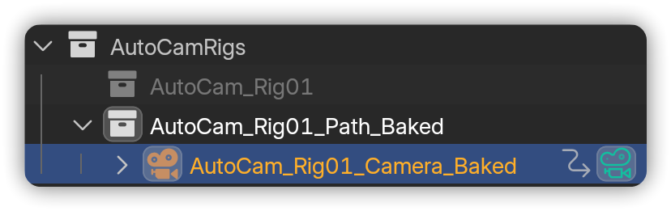

# Bake

Baking transforms your AutoCam rig into standard keyframes on a Blender camera. This process makes the animation **independent of AutoCam**, ensuring consistent playback across different computers, render farms, or other digital content creation (DCC) tools.

<figure><figcaption></figcaption></figure>


**Note:** Requires an **AutoCam** [**Rig**](rig.md).


***

## Bake the rig


**Prerequisites:**

* An **AutoCam** [**Rig**](rig.md) is present.




In the 3D View, press **N** → open **AutoCam**.

<figure><figcaption></figcaption></figure>




Verify the header displays the correct rig, then click the <i class="fa-gear">:gear:</i> button beside the Bake button.

<figure><figcaption></figcaption></figure>




Configure your **Baking Settings**.

<figure><figcaption></figcaption></figure>

* **Frame Range:** Choose which frames to bake.
  * **Curve Range -** the rig/path span.
  * **Scene Range** - timeline start/end.
  * **Custom** - enter start/end frames.
* **Step:** Write keys every **N** frames.
  * **1** = Every frame (recommended for final).
  * **Higher values** = Fewer keys, but less precise motion/DoF.
* **Depth of Field:** Decide how focus is handled.
  * **Keyframes** - Bake FocusPoint into Focus Distance keys (export-safe).
  * **Use Focus Object** - Uses the original FocusPoint.
  * **Off** - Disable DoF entirely.
* **Set as active scene camera:** Make the newly baked camera the active render camera immediately.
* **Suffix:** Append text to the baked camera’s name (e.g., `_Baked`) for easy identification.



Click on the **Bake button** to start the baking process.

<figure><figcaption></figcaption></figure>



A new **baked camera** is created. AutoCam controls hide for that camera.

<figure><figcaption></figcaption></figure>




Baking through AutoCam is **non-destructive** because the original rig collection remains intact. To revert, simply delete the "**\_Baked**" collection and reactivate the original.


***

## When to bake <mark style="color:$info;">(quick checklist)</mark>

* You used **Dynamic** Rig Mode and want frame-perfect renders/exports.
* You’re sending to a **render farm** or sharing the file with someone **without AutoCam**.
* You’re **exporting to another DCC** (FBX/Alembic/etc).
* You want a **locked, lightweight** camera you can tweak with vanilla keyframes.

***

## Common Issues <mark style="color:$info;">(and quick fixes)</mark>

* _"DoF missing or wrong on the baked camera"_ - You chose **Use Focus Object** or **Off**. Re-bake with **Depth of Field** → **Keyframes** (export-safe).
* _"Controls disappeared"_ - You’re looking at the **baked** camera. Select the **original rig** to show controls.
* _"Export doesn't match preview"_ - Always export the **baked** camera, not the camera inside the rig collection.


Learn more about [**Panel States**](ui-overview.md#panel-states) to understand how it changes based on the context.


***

## Next steps

* See practical examples → [**Guides**](../guides.md)
* Or jump back to [**Quick Start**](../../welcome/quick-start.md) to see the whole workflow.

&#x20;&#x20;
