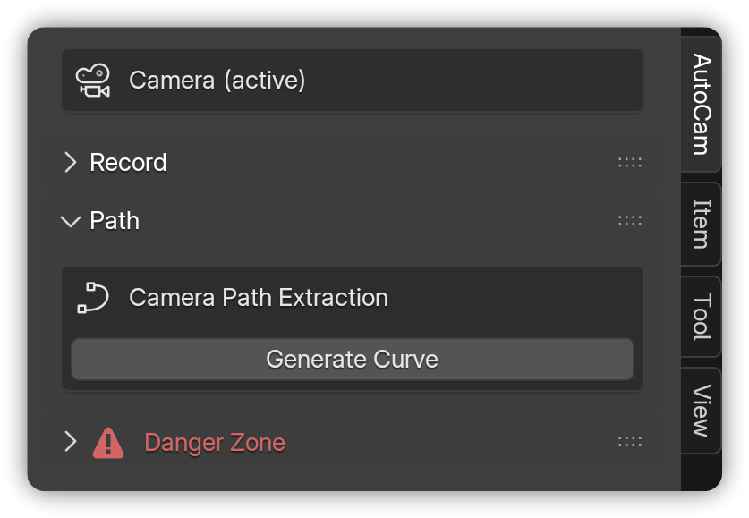
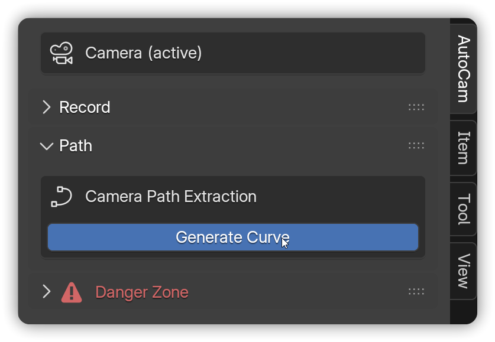
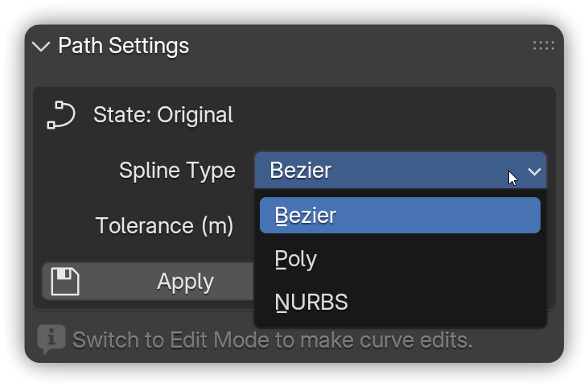

# Path

Convert your recorded camera movements into an **editable curve**, serving as the backbone for your AutoCam rig. You can select the spline type, adjust tolerance, and refine points in Edit Mode both before and after generating the rig.

<figure><figcaption></figcaption></figure>


**Note:** Requires a camera with **location keyframes**, either [recorded](record.md) or manually animated.


***

## Path Extraction


**Prerequisites:**

* A camera **with location keyframes** exists (see [**Record**](record.md) if not).
* Ensure the camera is **selected**, regardless of whether it is active or inactive.




In the 3D View, press **N** → open **AutoCam**.

<figure><figcaption></figcaption></figure>




Select the **animated camera** → click **Generate Curve**.

<figure><figcaption></figcaption></figure>




Pick a **Spline Type**:

* **Bezier** → Smooth, familiar handles.
* **Poly** → Straight segments, snappy movement.
* **NURBS** → Very smooth with minimal points.


Click **Apply** to see your changes.


<figure><figcaption></figcaption></figure>



Adjust **Tolerance** to simplify the curve. Higher values = fewer points.


Click **Apply** to see your changes.


<figure><figcaption></figcaption></figure>



Use **Edit Mode** to adjust points or reshape the curve entirely.


Click **Apply** to see your changes.


<figure><figcaption></figcaption></figure>




**Note:** Always **press Apply while still in Edit Mode** (if you’ve changed the curve points).

* **Apply** (Edit Mode) → Apply saves your edits and updates the curve sample.
* **Apply** (Object Mode) → Apply ignores your edits and restores the original curve.
* **Reset** (Any Mode) → Fully restores the curve to its original shape based on the set **Tolerance** level.

Once you click **Apply** in Edit Mode, that version becomes your **new baseline**. Lowering the Tolerance afterwards won’t bring back the detail that’s already been removed.



**Tip:** Under **Path Settings**, the **State** indicator shows which sample you’re editing:

* **Original**: You haven’t applied any edits yet. Curve is using the original samples.
* **Edited**: You have applied edits in Edit Mode. Curve is using the updated samples.


***

## Common Issues <mark style="color:$info;">(and quick fixes)</mark>

* _"Generate Curve is greyed out"_ - The selected camera has no **location** keyframes. [Record](record.md) or keyframe it manually.
* _"My edits vanished after Apply"_ - You clicked **Apply** in Object Mode. Re-edit and **Apply in Edit Mode** to update the sample.


Learn more about [**Panel States**](ui-overview.md#panel-states) to understand how it changes based on the context.


***

## Next steps

* Drive the path with a rig → [**Rig**](rig.md)
* Or jump back to [**Quick Start**](../../welcome/quick-start.md) to see the whole workflow.

&#x20;&#x20;
