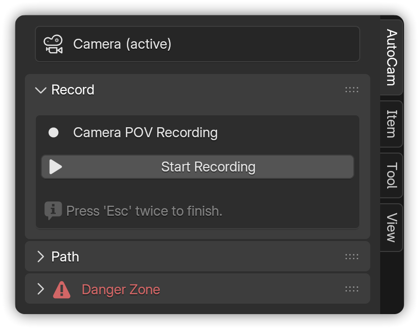
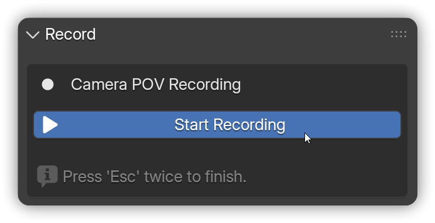

# Record

Fly through your scene like a video game, and AutoCam captures that motion as keyframes on your camera. This rough animation becomes the foundation for the AutoCam path and camera rig.

<figure><figcaption></figcaption></figure>


**Note:** Recording is optional. If your camera already has location keyframes, you can skip ahead to [**Path**](path.md)**.**


***

## Start a recording


**Prerequisites:**

* A **Camera** exists in the scene (**Shift + A** → **Camera**).
* It’s set as the **active scene camera** (AutoCam header → **Make Active**).




In the 3D View, press **N** → open **AutoCam**.

<figure><figcaption></figcaption></figure>




Click **Start Recording**.

<figure><figcaption></figcaption></figure>




**Fly like a game** ([see controls](record.md#default-controls)).

<figure><figcaption></figcaption></figure>



Press **Esc** or **Left/Right Mouse Click** to stop.

<figure><figcaption></figcaption></figure>




**Note:** Recording always uses the **active scene camera,** regardless of the selected camera.


***

## Default controls

| Action                  | Keys/Mouse      |
| ----------------------- | --------------- |
| Forward / Back          | **W / S**       |
| Left / Right            | **A / D**       |
| Down / Up               | **Q / E**       |
| Look / Orbit            | **Mouse**       |
| Accelerate / Decelerate | **Scrollwheel** |
| Stop recording          | **Esc** (twice) |


**Tip:** AutoCam utilizes Blender’s built-in **Walk Navigation** mode for recording.

To customize movement key bindings:

1. Go to **Edit** → **Preferences** → **Keymap**.
2. Navigate to **3D View** → **View3D Walk Modal**.
3. Adjust **Forward**, **Backward**, **Left**, **Right**, **Up**, and **Down** controls as needed.


***

## Tips for clean recordings

* **Plan your move.** Have a rough path in mind before you hit record.
* **Keep it flowing.** Avoid retracing steps to reduce path cleanup later.
* **Control your speed.** Use the scroll wheel to adjust acceleration on the fly.

***

## What exactly gets recorded?

* **Location/Rotation keys** are written to the **active scene camera** from the **frame where you start recording** until you stop.
* The camera's functionality remains unchanged; it continues to function as a regular Blender camera.

***

## Common Issues <mark style="color:$info;">(and quick fixes)</mark>

* _"Nothing recorded"_ - Ensure the camera is **active**, then try again. Keyframes will only appear on the timeline when you select the correct camera where the motion was recorded.
* _"Recording is laggy"_ - Try using minimal viewport shading, simplify the scene, and ensure complex objects remain stationary while recording.
* _"Record panel disappeared"_ - Make sure that the selected object does not belong to an already generated AutoCam rig.


Learn more about [**Panel States**](ui-overview.md#panel-states) to understand how it changes based on the context.


***

## Next steps

* Turn this recording into an editable curve on [**Path**](path.md).
* Or jump back to [**Quick Start**](../../welcome/quick-start.md) to see the whole workflow.

&#x20;&#x20;
