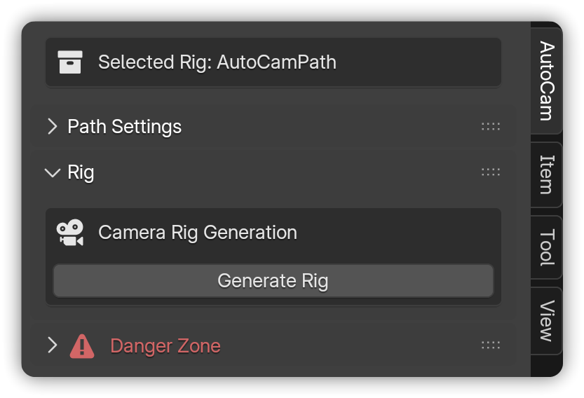
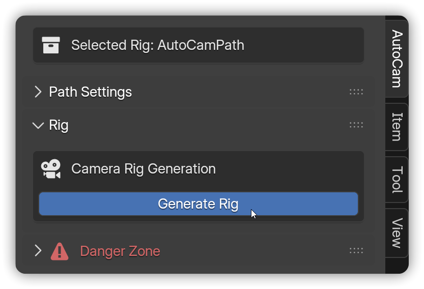

# Rig

Create a versatile camera rig in a single click to follow your extracted path. Easily keyframe **Speed**, switch between different **Rig Modes**, and control camera aim with straightforward **Tracking** options.

<figure><figcaption></figcaption></figure>


**Note:** Requires an **AutoCam** [**Path**](path.md) object


***

## Rig Generation


**Prerequisites:**

* An **AutoCam curve** is present (see [**Path**](path.md)).
* Select the **curve**. The **Rig** panel will appear.




In the 3D View, press **N** → open **AutoCam**.

<figure><figcaption></figcaption></figure>




Make sure the **AutoCam path** is selected → click **Generate Rig**.

<figure><figcaption></figcaption></figure>




Press **Play** on the Timeline to preview.

<figure><figcaption></figcaption></figure>



***

## Rig Settings

Adjust parameters such as speed and tracking preferences to tailor your AutoCam rig's behavior.

### Rig Mode

Control how AutoCam **interprets movement along the path**.

<strong>Simple (Keyframed):</strong>

Drives the camera along the curve using Blender’s native **Follow Path** object constraint.

<figure><figcaption></figcaption></figure>

#### **Speed (Keys):**

Sets a constant travel rate along the path. Use **one value** (don’t animate it).

Under the hood, AutoCam scales all **Offset Factor** keys together (Follow Path) so their **relative timing stays the same** while the whole move gets faster or slower.

#### **Sync Speed to Keys:**

Matches **Speed** to the **shot length you set on the timeline**.

If you slide the last **Offset Factor** key to a new end frame and click **Sync,** AutoCam recalculates Speed so the camera **finishes exactly on that frame**.

This prevents the last key from "snapping back" if you touch Speed later and lets you fine-tune safely.

<strong>Dynamic (Realtime):</strong>

Drives the camera with AutoCam’s **dynamic evaluator** (custom constraints).\
**Speed is read every frame**, so you can accelerate (`+`), pause (`0`), or reverse (`-`) in real time.

<figure><figcaption></figcaption></figure>

#### **Speed (Keys):**

Keyframe **Speed** to shape timing.

* **Positive values** = Forward
* **Zero** = Hold
* **Negative values** = Reverse


**Note:** Because Dynamic is live-evaluated, [**Bake**](bake.md) before final render/export to lock the result.


### Tracking

Control **where the camera looks** as it travels the path.

<strong>Manual Aim:</strong>

The "**\_Aim**" object (and consequently the camera) actively follows the "**\_LookAt**"  object with no tracking automation. The LookAt object needs to be placed or animated manually.

<figure><figcaption></figcaption></figure>

#### **LookAt:**

Move the spherical **LookAt** empty onto your subject. Keyframe its position (or parent it to the subject) to steer the camera’s aim.

#### **FocusPoint:**

A dedicated **FocusPoint** object, assigned to the camera’s **Focus on Object** (under Depth of Field). You can position or animate it to control the focal distance.

By default, the FocusPoint is **parented to the LookAt**, so when the LookAt moves, the FocusPoint follows. However, you can still move or keyframe the FocusPoint independently for fine-tuned control of focus, even when the LookAt stays fixed.

<strong>Match Recording:</strong>

Mutes the **Track To** object constraint on the "**\_Aim**" object and uses the camera’s **recorded rotation keyframes** from your original camera animation. Position still comes from the path.

<figure><figcaption></figcaption></figure>

#### **Simplify:**

Sets the **tolerance** for removing tiny rotation keys.

**Higher values** allow more deviation → **fewer keys** (but too high can erase intended arcs).

#### **Smoothing:**

Applies a **Butterworth-style low-pass filter** to each rotation axis to reduce high-frequency jitter.

Higher = **smoother** but more softened direction changes.

***

## Common Issues <mark style="color:$info;">(and quick fixes)</mark>

* _"No movement"_ - Make sure **Speed ≠ 0** and the timeline is playing. Additionally, try going to the beginning of the timeline, switching the **Rig Mode,** and then switching back to your preferred mode.
* _"Timing drifts"_ - Try **Simple** mode for frame-accurate results.
* _"Aiming feels off"_ - Set **Tracking** to **Manual Aim**, then adjust your LookAt manually.


Learn more about [**Panel States**](ui-overview.md#panel-states) to understand how it changes based on the context.


***

## Next steps

* Lock in the result for rendering/export → [**Bake**](bake.md)
* See common workflows → [**Guides**](../guides.md)
* Or jump back to [**Quick Start**](../../welcome/quick-start.md) to see the whole workflow.

&#x20;&#x20;
