# UI Overview

This page provides a quick overview of the layout, explains the purpose of each panel, and describes how they respond in various contexts.

Think of it as a map- start here to understand where everything lives, then jump into the dedicated pages for each panel.

&#x20;

***

&#x20;

## Introduction


{% column width="58.333333333333336%" %}

<figure>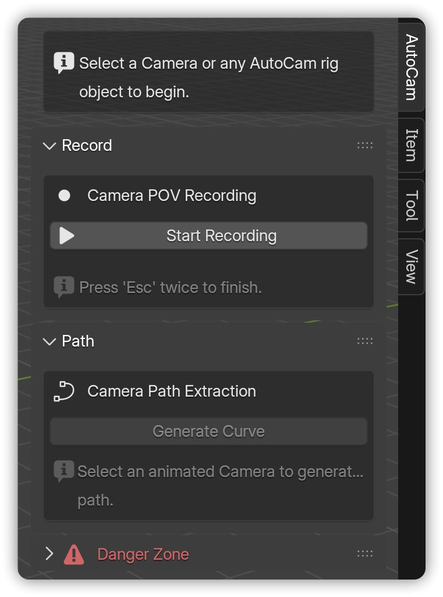<figcaption></figcaption></figure>



{% column width="41.666666666666664%" valign="middle" %}
The AutoCam interface lives in\
**3D View** → **N-panel** → **AutoCam**.



&#x20;

***

&#x20;

## Header States

The header shows what's selected and unlocks the right controls.


{% column width="50%" valign="middle" %}
When the user selects a non-camera object, such as a cube, they are prompted to choose the correct object:


{% column width="50%" valign="middle" %}
<figure>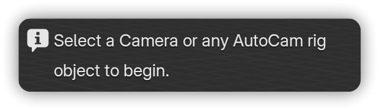<figcaption></figcaption></figure>



***


{% column width="50%" valign="middle" %}
If a camera is selected, it can be made the active scene camera before moving on to recording:


{% column width="50%" valign="middle" %}
<figure>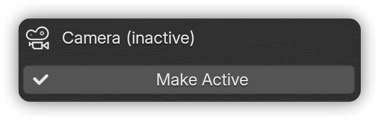<figcaption></figcaption></figure>



***


{% column width="50%" valign="middle" %}
When you select an object created by AutoCam, the rig's name is displayed:


{% column width="50%" valign="middle" %}
<figure>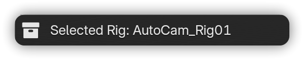<figcaption></figcaption></figure>



&#x20;

***

&#x20;

## Panel States

Panels within the AutoCam interface dynamically update based on the context, similar to the header.

&#x20;

### **Record** panel:


{% column width="50%" valign="middle" %}
The **Record** panel is always displayed, except when the selected object is generated by AutoCam.

In such cases, the panel is hidden to keep the UI uncluttered.


[Learn more](record.md) about **Camera POV Recording**.



{% column width="50%" valign="middle" %}
<figure>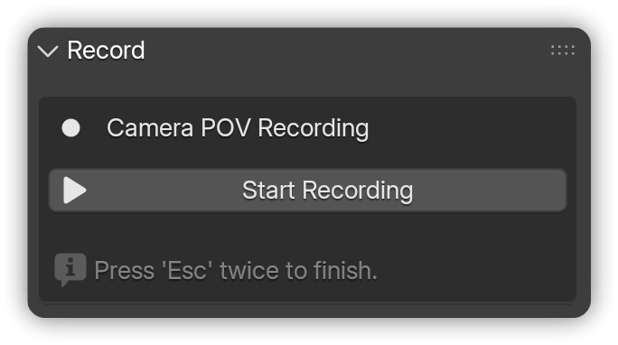<figcaption></figcaption></figure>



&#x20;

***

&#x20;

### **Path** panel:


{% column width="50%" valign="middle" %}
When the selected object is a non-camera object, the **Path** panel prompts the user to select an animated camera.


{% column width="50%" valign="middle" %}
<figure>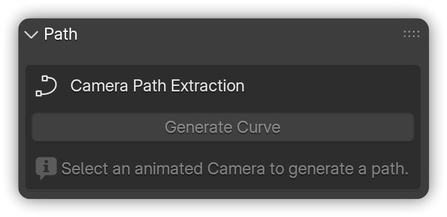<figcaption></figcaption></figure>



***



If a camera is selected, but it lacks animation data, it updates the prompt.



<figure>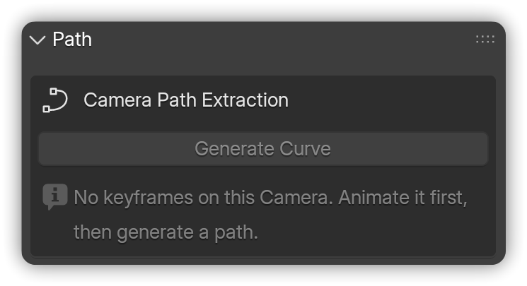<figcaption></figcaption></figure>



***



When the user finally selects an animated camera, the **Generate Curve** button is enabled, and the prompt is hidden.



<figure>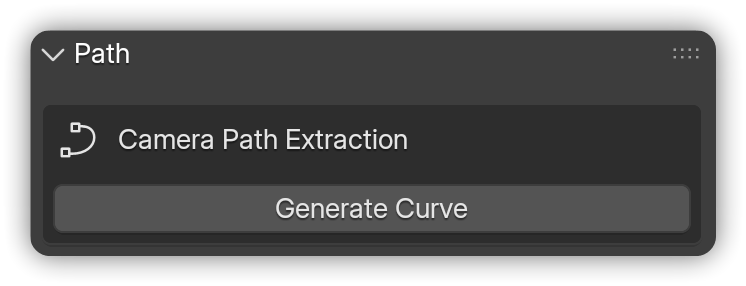<figcaption></figcaption></figure>



***



However, when an AutoCam object is selected, the **Path Settings** panel appears.


[Learn more](path.md) about **Path Settings**.




<figure>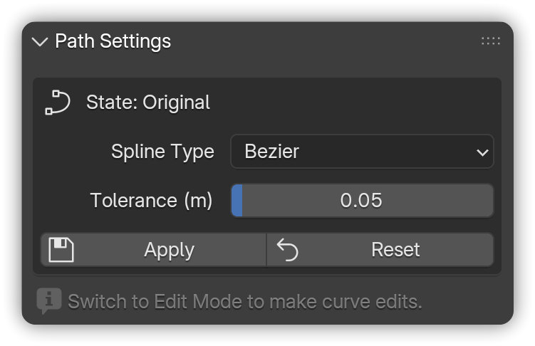<figcaption></figcaption></figure>



&#x20;

***

&#x20;

### **Rig Settings** panel:



The **Rig** panel appears only when an AutoCam-generated curve <mark style="color:$info;">(AutoCamPath)</mark> is selected.



<figure>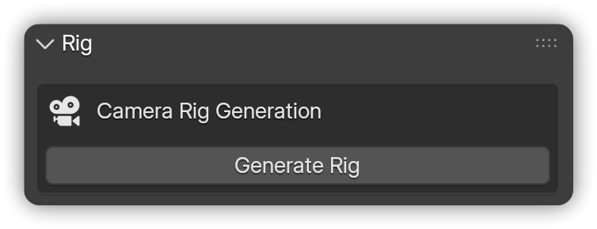<figcaption></figcaption></figure>



***



The **Rig Settings** panel is visible whenever any AutoCam object is selected.


[Learn more](rig.md) about **Rig Settings**.




<figure>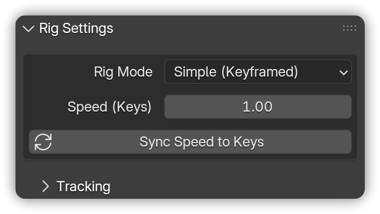<figcaption></figcaption></figure>



***

&#x20;

### **Bake** panel:



The **Bake** panel appears when the selected object is an AutoCam object.

Selecting the new 'baked' camera hides the panel to prevent accidental re-baking.


[Learn more](bake.md) about **Baking**.




<figure>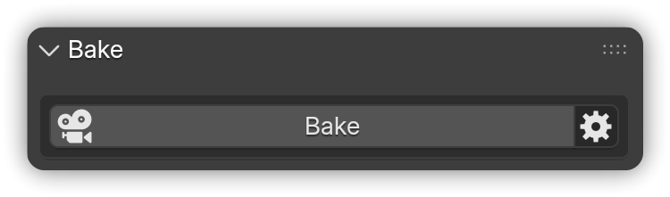<figcaption></figcaption></figure>



&#x20;

***

&#x20;

## User Preferences

Access AutoCam’s user preferences to change the default settings:\
**Edit** → **Preferences** → **Add-ons** → **AutoCam** → expand to see user preferences.

Preferences affect **new** rigs/paths you create; they don’t retroactively change existing ones.


**Tip:** Toggle **Danger Zone** according to your preference. This unlocks destructive operations such as clearing all AutoCam rigs in a single click.


&#x20;

***

&#x20;

## Next steps

* **Learn each feature in depth** → [**Record**](record.md) **-** [**Path**](path.md) **-** [**Rig**](rig.md) **-** [**Bake**](bake.md)
* **See practical examples** → [**Guides**](../guides.md)
* **Having issues?** Start with [**Troubleshooting**](../../help/troubleshooting.md), check the [**FAQ**](../../help/faq.md), and contact [**Support**](../../help/support.md) if necessary.

&#x20;
